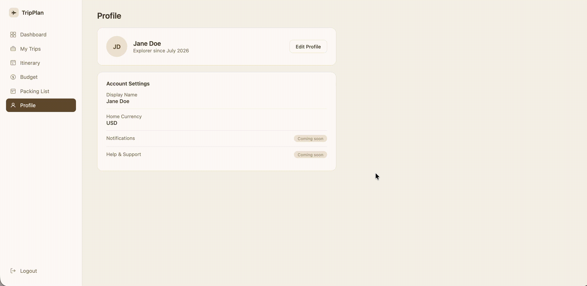
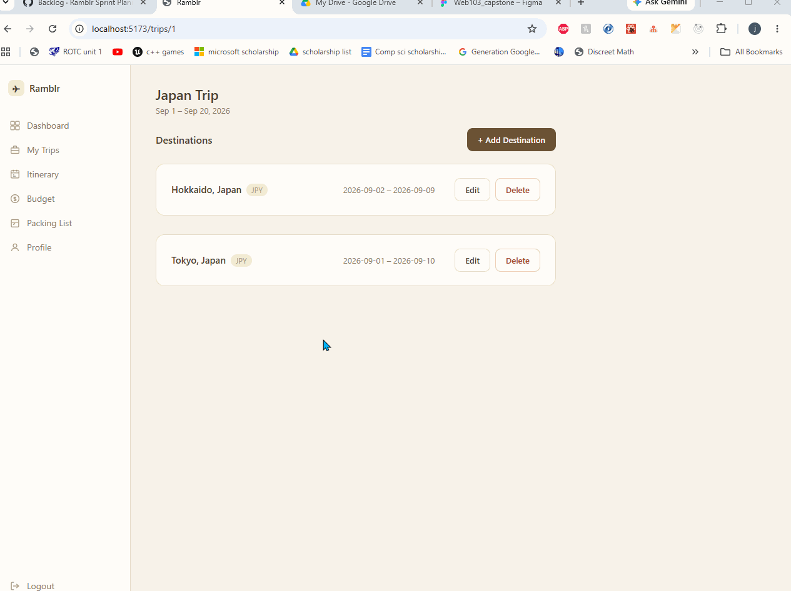
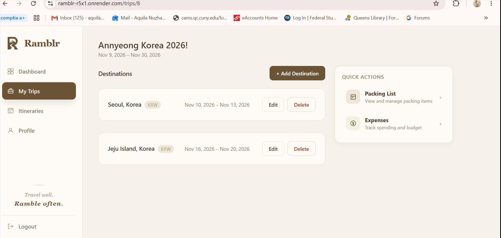

# Ramblr

CodePath WEB103 Final Project

Designed and developed by: Zainab Akhtar, Jasper Caballero, Aquila Nuzhat

🔗 Link to deployed app: https://ramblr-r5x1.onrender.com/dashboard 

## About

### Description and Purpose

A web platform designed to help travelers plan out every aspect of their trip in one place!

### Inspiration

As we have experienced the struggle to plan a trip across different platforms for lodging, activities, etc. we shared the sentiment of wanting to able to plan it all in one place. And thus, Ramblr became our theme!

## Tech Stack

Frontend: React
Backend: Node.js, Express
Database: PostgreSQL

## Features

### 1: User

Will store the name, and currency user uses



### 2: Trips

Will store title, and display dates of trips (Endpoints complete)


### 3: Destinations

Will store city, country, startdate, enddate, arrival order



### 4: Activities

Will store the location and type of activity to be part of the trip itinerary


### 4: Expenses

Will add up the costs of all the activities planned + lodging + transportation to give user a summary of trip expenses


### 5: Packing List

Will store all the items the user plans to take (ie. clothes, travel sized lotion, scuba gear)


### 6: Weather API

A tab displaying the weather for all the days of the trip so that the user can plan accordingly



## Installation Instructions

### Prerequisites

Make sure you have the following installed:

* Node.js (v18 or later recommended)
* npm
* PostgreSQL

### 1. Clone the repository

you can either do the following code in git:

```bash
git clone <repository-url>
cd <repository-name>
```

### 2. Install dependencies

Install the frontend dependencies:

```bash
cd client
npm install
```

Install the backend dependencies:

```bash
cd ../server
npm install
```

### 3. Configure environment variables

Create a `.env` file inside the `server` directory and add your PostgreSQL configuration which should look like the following:

```env
PGHOST=your_host_name-a.oregon-postgres.render.com
PGPORT=5432
PGDATABASE=your_database_name
PGUSER=your_username
PGPASSWORD=your_password
NODE_ENV=development
```

### 4. Set up the database

Then run the following script:

```bash
npm run reset
```

This will create the necessary tables and seed the database with sample data.

### 5. Start the frontend and backend server

```bash
npm run dev
```

The backend will run on:

```
http://localhost:3000
```

The frontend will run on:

```
http://localhost:5173
```

### 6. Open the application

Visit:

```
http://localhost:5173
```
