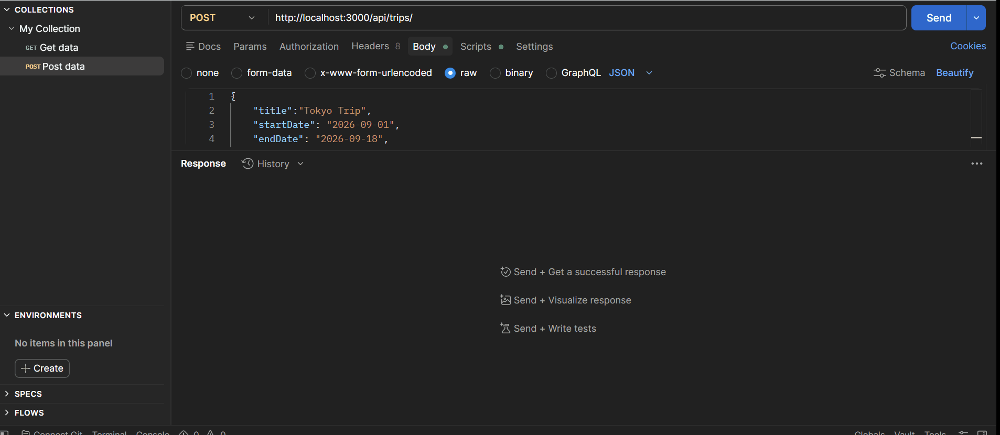
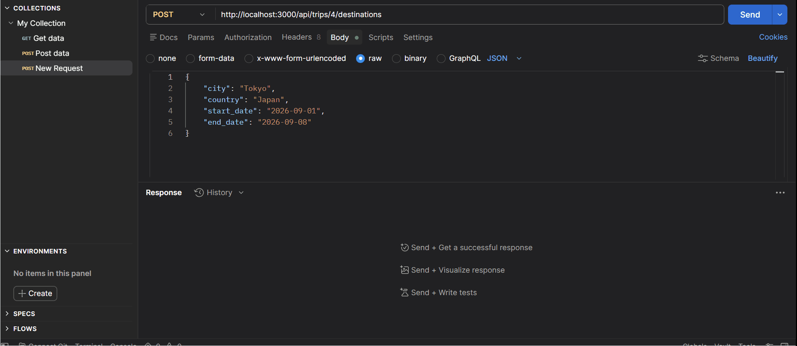

# Ramblr

CodePath WEB103 Final Project

Designed and developed by: Zainab Akhtar, Jasper Caballero, Aquila Nuzhat

🔗 Link to deployed app:

## About

### Description and Purpose

A web platform designed to help travelers plan out every aspect of their trip in one place!

### Inspiration

As we have experienced the struggle to plan a trip across different platforms for lodging, activities, etc. we shared the sentiment of wanting to able to plan it all in one place. And thus, Ramblr became our theme!

## Tech Stack

Frontend:

Backend:

## Features

### 1: User

Will store the name, and currency user uses

### 2: Trips

Will store title, and display dates of trips (Endpoints complete)

### 3: Destinations

Will store city, country, startdate, enddate, arrival order

### 4: Activities

Will store the location and type of activity to be part of the trip itinerary

### 4: Expenses

Will add up the costs of all the activities planned + lodging + transportation to give user a summary of trip expenses

### 5: Packing List

Will store all the items the user plans to take (ie. clothes, travel sized lotion, scuba gear)

### 6: Weather API

A tab displaying the weather for all the days of the trip so that the user can plan accordingly

## Installation Instructions

[instructions go here]
